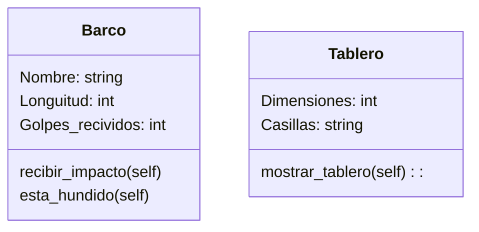

```mermaid

classDiagram
        class Barco {
          Nombre: string
          Longuitud: int
          Golpes_recividos: int 
          recibir_impacto(self)
          esta_hundido(self)
        }
        class Tablero{
            Dimensiones: int
            Casillas: string
            mostrar_tablero(self):
        }
        
```